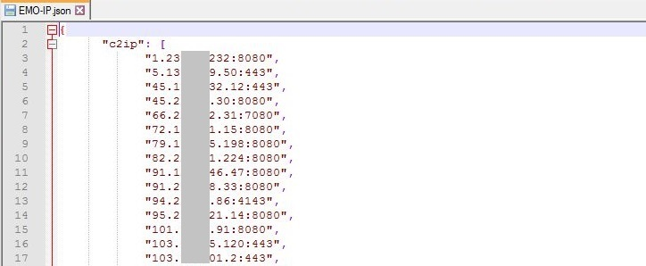
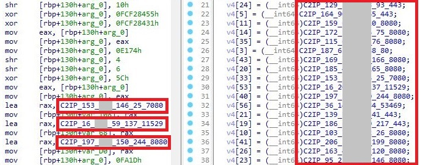

# EMO-IP（エモ・アイピー）

## 概要
- EMO-IP は、アンパックしたEmotet 本体から、C2サーバのIPアドレスとポート番号を抽出する IDAPython スクリプトです。
- Emotet (E.dll_v202303) に対応しています。

## 機能
### 機能１：C2サーバのIPアドレスとポート番号を抽出し、JSON形式でファイルに出力する
 
アンパックしたEmotet 本体から、C2サーバのIPアドレスとポート番号を抽出し、JSON形式で ファイルに出力します。 
（実際に使用されるIPアドレスとポート番号のみ出力します）

### 機能２：復号処理を行う関数に名前を付ける
 
IPアドレスとポート番号の復号処理を行う関数に、”C2IP_IPアドレス_ポート番号”という形式で 名前を付けます。 
（使用されないIPアドレスとポート番号の場所も対象になります）

### 機能３：復号処理の部分にコメントを付ける
 
IPアドレスとポート番号の復号処理が行われる部分に、復号結果をコメントとして追記します。 
（使用されないIPアドレスとポート番号の場所も対象になります）

## 動作要件[^1]
- IDA Pro 8.2
- Python 3.8.5
- [numpy](https://pypi.org/project/numpy/) 1.24.2

## インストール方法
- EMO-IP.py を任意のフォルダに保存してください。

## 使用方法
1. アンパックしたEmotet 本体を、IDA Pro に読み込みます。
2. IDA Pro ウィンドウから [File] -> [Script file...] -> EMO-IP.py を選択します。
3. 抽出処理が完了すると、ファイルダイアログが表示されます。抽出した情報をファイルに保存します。 
（抽出処理が失敗した場合は、output window に"no c2ip were found" と表示されます）

## 謝辞
- EMO-IP は、DeepInstinct 社のDeMotet から着想を得て作成しました。
 
[^1]: 記載されているバージョンは、開発環境で使用していたものです。これ以外のバージョンでも動作する場合があります。
